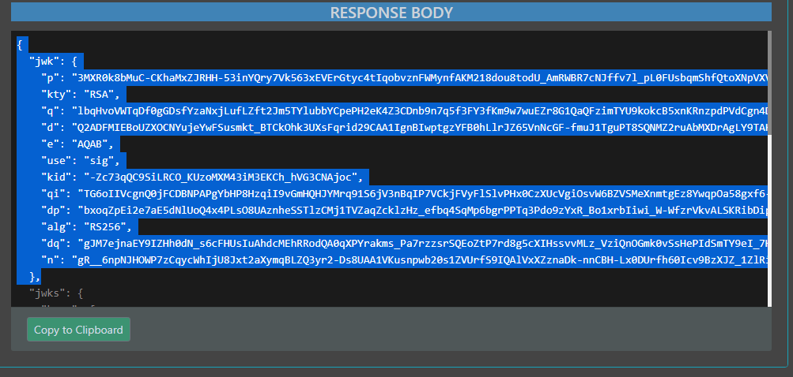

# esignet-mock-services
Repository contains mock implementation of auth for e-signet

## Installing in k8s cluster using helm
### Pre-requisites
1. Set the kube config file of the Esignet K8 cluster having dependent services.
1. Below are the dependent services required for Mock Identity Services deployment:
   | Chart | Chart version |
   |---|---|
   |[Postgres](https://github.com/mosip/mosip-infra/tree/v1.2.0.1-B3/deployment/v3/external/postgres) | 10.16.2 |
   |[Postgres Init](https://github.com/mosip/mosip-infra/tree/v1.2.0.1-B3/deployment/v3/external/postgres) | 12.0.1-B3 |
   |[mock-identity-softhsm](https://github.com/mosip/esignet/blob/v1.0.0/helm/install-all.sh) | 12.0.1-B2 |

### Install Pe-req for mock identity service
* Install `kubectl` and `helm` utilities.
* Run `prereq-mockid.sh` to setup below mentioned pre-requisites for mock-identity-system.
  * Setup softhsm for mock-identity in `Softhsm` namespace.
  * Copy required `configmaps` and `secrets` to `mockid` namespace.
  * Initialise mock Identity DB. 
  ```
  cd deploy
  ./prereq-mockid.sh
  ```
### Install esignet mock services
* Install `kubectl` and `helm` utilities.
* setup `KUBECONFIG` variable to point to esignet k8 cluster kubeconfig file.
  ```
  export KUBECONFIG=path/to/kubeconfig.config
  ```
* Execute installation script:
  ```
  ./instll-mock.sh
  ```
* During installation of each module a prompt appears requesting information regarding the presence of a public domain and a valid SSL certificate on the server. 
  * Opt (y,Y) : In case the Domain is mapped publically and valid SSL certificate is present.
  * Ops (n,N) : If the server lacks a public domain and a valid SSL certificate, it is advisable to select the `n` option.
    * Opting it will enable the `init-container` with an `emptyDir` volume and include it in the deployment process.
    * The init-container will proceed to download the server's self-signed SSL certificate and mount it to the specified location within the container's Java keystore (i.e., `cacerts`) file.
    * This particular functionality caters to scenarios where the script needs to be employed on a server utilizing self-signed SSL certificates.
* During Installation a prompt is there to confirm if prometheus service monitor is already deployed.
  * Opt (y,Y) : In case Monitoring is installed with prometheus service monitor.
  * Ops (n,N) : In case Monitoring is not installed or prometheus service monitor is not available.

### Delete
* Run `delete-mock.sh` to remove esignet services.
  ```
  cd deploy
  ./delete-mock.sh
  ```

### Restart
* Run `restart-mock.sh` to restart esignet services.
  ```
  cd deploy
  ./restart-mock.sh
  ```

## Onboard esignet mock and relying party services
* Run onboarder's [install.sh](partner-onboarder) script to exchange jwk certificates.
### Configurational steps after onboarding is completed.
*  Below mentioned onboarding steps are added after 1.2.0.1-b3
   *  Onboarding the default demo-oidc partner


### Onboarding the default demo-oidc partner
*  After successfull partner onboarder run for demo-oidc partner , download html reports from `onboarder` bucket of object store .
*  Get `CLIENT_ID` from  response body of  request `create-oidc-client` from the report **_demo-oidc.html_**
*  Update deployment of `mock-relying-party-ui` in esignet namespace with `CLIENT_ID` value from last step .
*  As per screenshot get the private and public key pair (shown as selected in the screenshot )from the response of the `get-jwks` request from the report **_demo-oidc.html_** 
   
*  Update the client-private-key stored within the secrets in the esignet namespace with the base64-encoded value derived from the keypair obtained in the previous step.
*  Restart mock-relying-party-service pod
